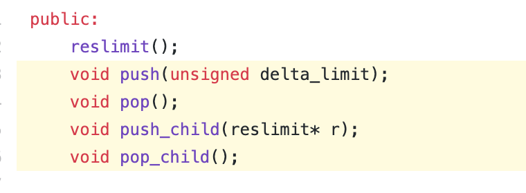

# QuickSMT

## Learning for SMT Speedup

Main Question: SMT solvers use a large number of hand-coded heuristics in order to determine which sequences of tactics to apply. Is it possible to use modern learning algorithms to improve upon such heuristics?

### Analysis of FastSMT

FastSMT is a system which aims to speed up the process of solving SMT formulas by using learning algorithms to find the optimal strategy for a dataset. It does so by first training a neural network on a dataset of formulas which predicts the best next tactic to use on the formula. At a high level, the network is being trained with the DAgger method, in which the new policy at each iteration is run on the training set, generating many new formulas which are added back into the dataset. The neural network is followed by a synthesis step to generate a program interpretable by z3 - a tree is synthesized using a Decision Tree-esque scheme in which if-then-else statements which maximize cross-entropy loss are generated at ech leve.

Our main issues with FastSMT are twofold:

First, the incredible results reflected in their paper are in terms of rlimit, z3’s internal operation counter. rlimit can be manipulated internally in order to optimize certain operations:

 There is a significant discrepancy between the rlimit count and raw wall clock time. When wall clock time is compared, best case speedup is much more modest (1.2-1.3x), and in the worst case it can even slow down performance (0.8-0.9x).

Second, the high cost of training seems unnecessary - FastSMT only uses six probes and a Bag of Words as features - we hypothesize that a simpler learning strategy could yield similar results without the huge overhead.

### Clustering and Random Strategies

We’ve written a simple script to investigate how much worse a far simpler learning strategy is. Our current process is:

1. Use KMeans to cluster the training set based on probes (potentially also Bag of Words/AST repr in the future)

2. For each centroid, randomly generate a sequence of "preprocessing" tactics per trial, and then put the result into the standard z3 solver. We then identify the shortest-running sequence from the large number of trials.

3. Given a new formula, identify which centroid is closest and apply the best sequence that we found.

The next task to be done is to gather data on performance of both FastSMT and our script on standard SMT benchmarks and Randy Bryant’s UCLID dataset. We will be measuring mean wall-clock solve time for a test set and training time. Our null hypothesis is that FastSMT will have a faster solve time and will have a far longer training time. If our null hypothesis is fully confirmed, we will experiment with other search strategies and attempt to learn to select between different specialized solvers.

### Search Strategies To Try

1. Evolutionary Search: Randomly seeded strategies can be considered "species" in the classic genetic search model. "Fitness" will be measured by solve time for a training set of queries. For each iteration, species will be crossed based on fitness, allowing us to search for strategies with the lowest possible solve time for our training set.

2. [Metropolis Hastings](http://www.mit.edu/~ilkery/papers/MetropolisHastingsSampling.pdf): We can model our search problem as attempting to find the invariant distribution of a continuous markov chain in which strategies are the states, edges are between strategies that are a single edit distance from each other, and transition rates are based off of solve time (higher solve time would lead to a higher transition rate out of a state, which would lead to it being picked fewer times).
